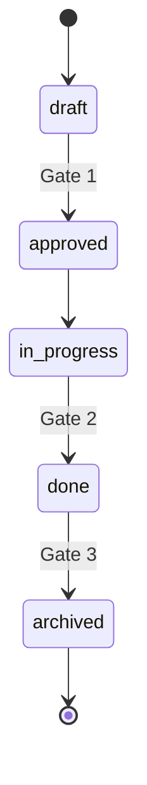

# Spec-driven development

**Every change starts with why, is written before code, and ends by updating the truth.**

```mermaid
stateDiagram-v2
    [*] --> draft
    draft --> approved: Gate 1
    approved --> in_progress
    in_progress --> done: Gate 2
    done --> archived: Gate 3
    archived --> [*]
```

This site is being assembled. Start with [the method](method.md).
